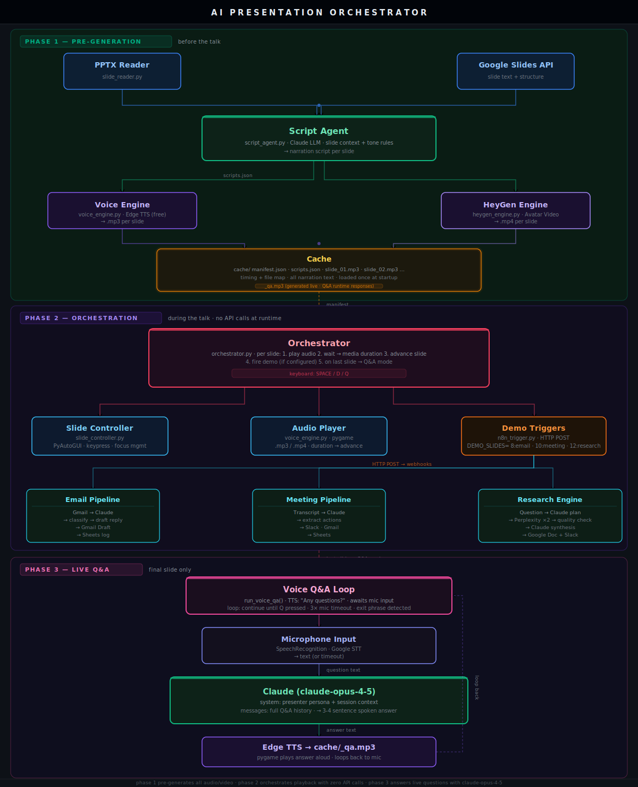

# AI Presentation Orchestrator

**Separate the compute from the performance.**  
Pre-generate everything. Cache it. Walk in and press Enter.

[](https://python.org)
[](LICENSE)


---

## What This Project Demonstrates

- **Two-phase system design** — generation and runtime are fully decoupled. All LLM calls, TTS synthesis, and video rendering happen before the presentation. The runtime reads a manifest and executes deterministically.
- **Cache-first pipeline** — every output is stored with a manifest. Partial runs resume from where they stopped. Nothing is regenerated unless explicitly forced.
- **Multi-modal orchestration** — synchronises audio playback, slide advancement, and live webhook triggers from a single timing source (actual media duration).
- **Modular integration layer** — TTS, avatar video, slide control, n8n, Slack, and Google APIs are all isolated modules. Swapping any one of them does not affect the core pipeline.
- **Agentic research workflow** — the Evidence Intelligence Engine decomposes a research question into sub-queries, runs dual web and academic search via Perplexity, evaluates evidence quality, and iterates before synthesis. Built entirely in n8n with Claude.

---

## The Problem

Live AI demos break at the worst moment.

API latency spikes. Video renders for 8 minutes. The webhook times out.
You are standing in front of a room and your terminal is showing a spinner.

The issue is not the tools. It is **running generation and performance in the same process**.

---

## Architecture



**Phase 1 — Pre-generation** (`python -m core.pre_generate`)  
Reads every slide, generates narration via Claude, synthesises audio or avatar video,
and writes everything to `cache/` with a timing manifest.
Resumable — re-runs skip already-completed slides.

**Phase 2 — Orchestration** (`python -m core.orchestrator`)  
Reads the manifest. Plays audio. Advances slides. Fires demo webhooks at configured slides.
No API calls. No generation. Deterministic from start to finish.

---

## n8n Workflows

Three importable workflows ship with the repo.

### Email Pipeline
```
Gmail Trigger / Webhook
  └─ Claude: classify intent, extract key ask, draft reply
       └─ Escalation Router
            ├─ [escalation]     Gmail Draft + CC colleague
            └─ [no escalation]  Gmail Draft only
                 └─ Log → Google Sheets
```

### Meeting Pipeline
```
Form / Webhook  ← paste any meeting transcript
  └─ Claude: action items, decisions, risks, follow-up email
       └─ Get attendees → Google Sheets
            ├─ Gmail — follow-up to all attendees
            ├─ Slack — #meeting-actions
            └─ Google Sheets — log row
```

### Evidence Intelligence Engine
```
Form / Webhook  ← research question or transcript
  └─ Claude: decompose into search plan + sub-queries
       ├─ Perplexity Web Search
       └─ Perplexity Academic Search
            └─ Evidence Evaluator (Claude)
                 ├─ [sufficient]              Brief Writer → Google Doc
                 └─ [insufficient, <2 rounds] refine + retry
                      └─ Slack — #research-briefs
                           └─ Google Sheets — research log
```

---

## Project Structure

```
ai-presentation-orchestrator/
│
├── core/
│   ├── orchestrator.py          main runtime controller
│   ├── pre_generate.py          pre-generation pipeline
│   ├── regenerate.py            selective slide regeneration
│   └── diagnose.py              pre-flight system checks
│
├── agents/
│   └── script_agent.py          LLM-based narration script generator
│
├── integrations/
│   ├── voice_engine.py          Edge TTS + audio duration detection
│   ├── heygen_engine.py         HeyGen avatar video (optional)
│   ├── slide_controller.py      PyAutoGUI slide control
│   ├── slide_reader.py          PPTX parser
│   ├── google_slides_reader.py  Google Slides API reader
│   ├── n8n_trigger.py           n8n webhook triggers
│   ├── slack_notifier.py        Slack notifications
│   └── logger.py                structured logging
│
├── n8n/
│   ├── Email-Pipeline.json
│   ├── Meeting-Pipeline.json
│   └── Evidence-Intelligence-Engine.json
│
├── demo/
│   ├── email_demo.txt
│   ├── meeting_transcript.txt
│   └── research_question.txt
│
├── docs/
│   └── RUNBOOK.md               presentation-day checklist
│
├── cache/                       auto-created — gitignored
├── logs/                        runtime logs — gitignored
├── workflow_monitor.html        live demo status page (no server needed)
├── credentials.example.json
├── env.example
└── requirements.txt
```

---

## Quick Start

```bash
git clone https://github.com/TrippyEngineer/ai-presentation-orchestrator.git
cd ai-presentation-orchestrator

pip install -r requirements.txt

cp env.example .env
# Set ANTHROPIC_API_KEY at minimum — everything else is optional

python -m core.diagnose          # all lines should show ✅

python -m core.pre_generate      # run 15–20 min before the talk
python -m core.orchestrator      # run when ready
```

**ffmpeg is required** for audio duration detection and is not pip-installable:

| OS | Install |
|----|---------|
| Windows | [gyan.dev/ffmpeg/builds](https://www.gyan.dev/ffmpeg/builds/) — add `bin/` to PATH |
| Mac | `brew install ffmpeg` |
| Linux | `sudo apt install ffmpeg` |

---

## Configuration

```env
# Required
ANTHROPIC_API_KEY=sk-ant-...

# Voice — Edge TTS is free and needs no key (default)
# To use HeyGen avatar video instead:
HEYGEN_API_KEY=...
HEYGEN_AVATAR_ID=...
HEYGEN_VOICE_ID=...

# Demo slide triggers — format: slide_number:workflow_type
DEMO_SLIDES=8:email,10:meeting,12:research

# n8n (required if using live demo triggers)
N8N_WEBHOOK_EMAIL=http://localhost:5678/webhook/email-demo
N8N_WEBHOOK_MEETING=http://localhost:5678/webhook/meeting-demo
N8N_WEBHOOK_RESEARCH=http://localhost:5678/webhook/research-demo

# Optional
SLACK_WEBHOOK_URL=https://hooks.slack.com/services/...
GOOGLE_SLIDES_PRESENTATION_ID=...
GOOGLE_SLIDES_CREDENTIALS_FILE=credentials.json
```

---

## Controls

| Key | Action |
|-----|--------|
| `SPACE` | Pause / resume narration |
| `D` | Skip demo countdown |
| `Q` | Quit |

---

## Importing n8n Workflows

1. Open n8n → **Import from file**
2. Import each JSON from `n8n/`
3. Reconnect credentials (Anthropic, Gmail, Google Sheets, Slack, Perplexity)
4. Toggle all workflows to **Active**
5. Verify triggers with `python -m integrations.n8n_trigger`

> The Evidence Intelligence Engine requires a Perplexity API key for web and academic search.

---

## Diagnostics

```bash
python -m core.diagnose
```

| Problem | Fix |
|---------|-----|
| No audio | Run `ffplay -version` — if it fails, ffmpeg is not on PATH |
| Slides not advancing | Click the presentation window once to give it keyboard focus |
| Webhook fails | Confirm n8n is running on port 5678 and workflows are Active |
| Pre-generation crashes | Re-run — completed slides are skipped automatically |

Logs: `logs/presentation_YYYYMMDD.log`

---

## Workflow Monitor

Open `workflow_monitor.html` in any browser before the talk.
No server. No dependencies. Shows live status of all three demo pipelines as they run.

---

## Contributing

Open an issue before starting anything significant.  
`good first issue` labels are kept current.

---

## License

[MIT](LICENSE)
